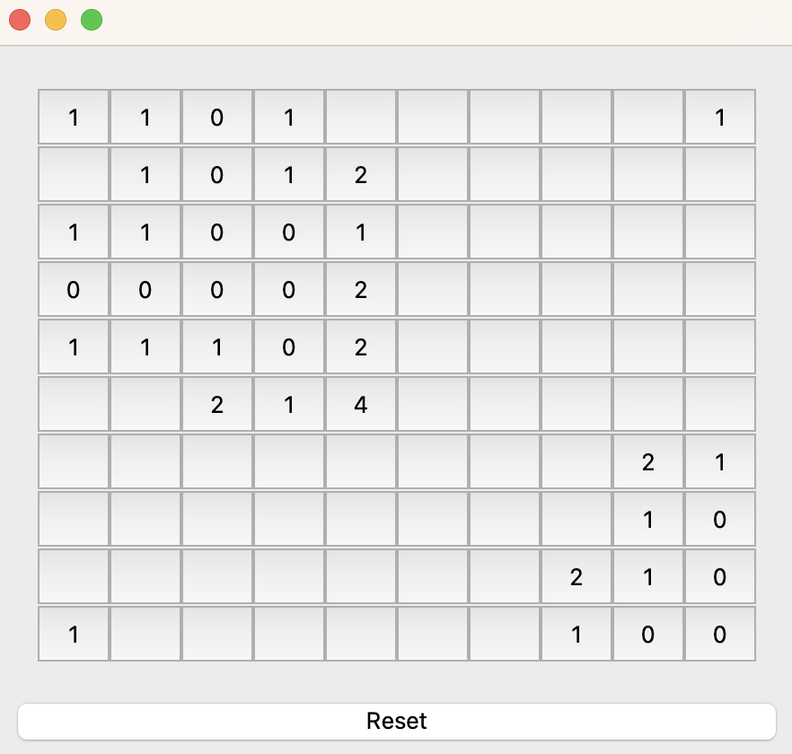

# Minesweeper

## Overview

This is a simple implementation of the classic Minesweeper game using C++ and Qt. The game allows users to uncover cells on a grid, trying to avoid mines, and aims to flag all mines correctly.

## Features

- **Customizable Grid Size**: Users can choose different grid sizes for varying levels of difficulty.
- **Flagging Mechanism**: Right-click to flag a cell if you suspect it contains a mine.
- **Mine Reveal**: If you click on a mine, the game is over, and all mines are revealed.
- **Win Condition**: Successfully flag all mines without clicking on any to win the game.

## Screenshots

## Installation

### Prerequisites

- **Qt**: Ensure that you have Qt installed on your system.
- **CMake**: Used to generate the build system.

